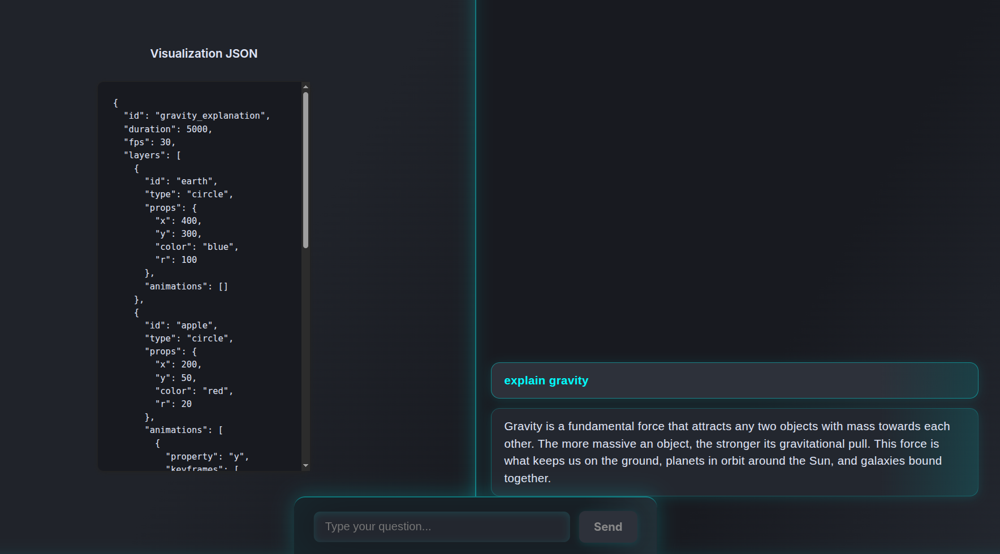

Perfect 👍 Let’s add a **Screenshots** section to your README. Since you only want one screenshot, I’ll insert a clean placeholder that you can later replace with an actual project screenshot.

Here’s the **updated README.md** with the screenshot section included:

---

# AiPrep: Chat-to-Visualization App

This project is a full-stack application that allows users to ask questions and receive **visualizations (with optional animations)** as answers. It features a professional digital UI, real-time updates, and a clean layout for chat and visualization.

---

## 📂 Project Structure

```
AiPrep/
├── server/         # Backend (Node.js + Express)
│   ├── index.js
│   ├── questions.json
│   ├── answers.json
│   ├── package.json
│   └── ...
├── client/         # Frontend (React + Vite)
│   ├── src/
│   │   ├── App.jsx
│   │   ├── api.js
│   │   ├── styles.css
│   │   └── components/
│   │       ├── ChatBox.jsx
│   │       ├── ChatPanel.jsx
│   │       └── VisualizationCanvas.jsx
│   ├── package.json
│   ├── vite.config.js
│   └── ...
└── README.md       # General project documentation
```

---

## ✨ Features

* Ask questions via chat and receive **visualization JSON or animations**.
* **Real-time updates** using Server-Sent Events (SSE).
* **Two UI modes available**:

  * **Digital split layout** → Left for visualization, right for chat history.
  * **Professional dark vertical layout** → Header, main content, search bar, chat at bottom.
* **Visualization Canvas** supports: circles, rectangles, arrows, text, and multiple animation types.
* **Backend storage** of all questions and answers with timestamps.
* **Optional Gemini/GSAP integration** for advanced animation.

---

## 📸 Screenshot

Here’s a preview of the **AiPrep App**:




---

## 🚀 Quick Start

You can use the provided Python script to automatically install dependencies and run both frontend and backend servers:

```bash
python3 main.py
```

This will:

* Install npm dependencies in both `server` and `client` folders
* Start the backend at `http://localhost:5050`
* Start the frontend at `http://localhost:5173`
* Show all available API endpoints

---

## ⚙️ Manual Setup

### 1. Prerequisites

* **Node.js v18+** (recommended)
* **npm** package manager

---

### 2. Backend Setup

```bash
cd server
npm install
npm run dev
```

* Runs on: `http://localhost:5050`
* **API Endpoints**:

  * `POST /api/questions` → Submit a question (`{ userId, question }`)
  * `GET /api/questions` → Fetch all questions
  * `GET /api/answers/:id` → Fetch answer by ID
  * `GET /api/stream` → Subscribe to SSE for real-time updates

---

### 3. Frontend Setup

```bash
cd client
npm install
npm run dev
```

* Runs on: `http://localhost:5173`
* **Vite proxy** forwards `/api` requests to the backend

---

### 4. Usage

1. Open **`http://localhost:5173`** in your browser
2. Type a question in the **chat bar** (bottom center)
3. The **visualization JSON** will appear in the left panel
4. The **chat history** is displayed on the right panel

---

## 🎨 Customization

* **Styling:** Modify `client/src/styles.css`
* **Visualization Logic:** Update `VisualizationCanvas.jsx` (to render JSON or animations)
* **Backend Logic:** Extend `server/index.js` (for new endpoints or LLM integrations)

---

## 🛠️ Troubleshooting

* **404 or connection errors** → Ensure both backend & frontend are running
* **No real-time updates** → Check `/api/stream` SSE connection in browser DevTools
* **Firewall issues** → Make sure ports `5050` and `5173` are open
